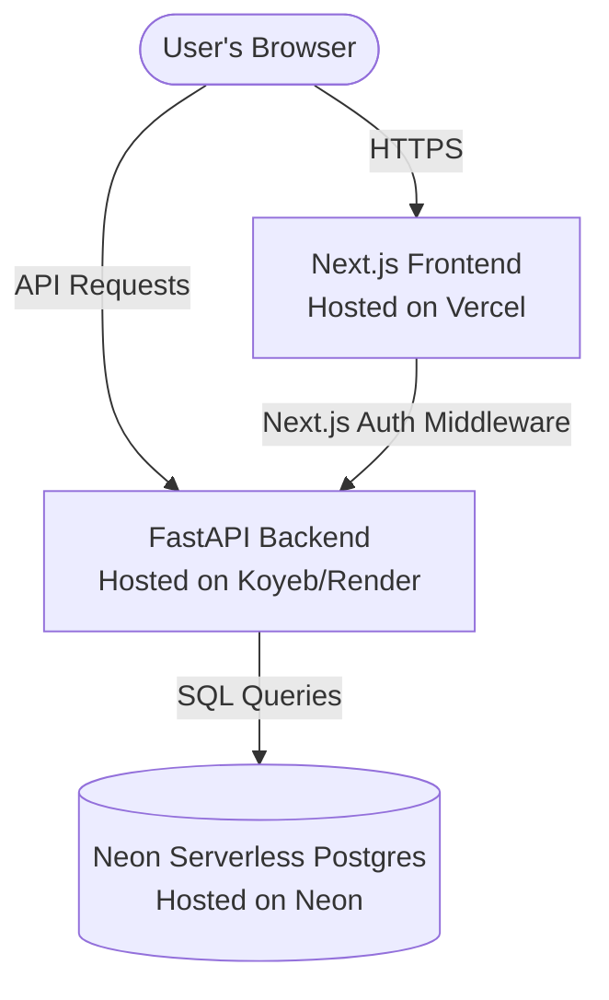
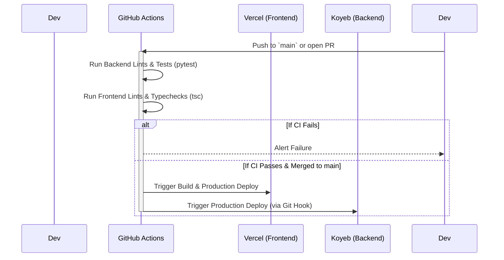

# Todo App MVP: Deployment & CI/CD Strategy Report

This report outlines the brainstorming, platform options, recommended architecture, and CI/CD setup for deploying our full-stack Todo application on free-tier platforms.

---

## 1. Tech Stack Overview & Deployment Requirements

Our application is built as a decoupled monorepo, requiring three main components to run in production:



*   **Frontend (Next.js 16)**: Requires an environment capable of running Next.js App Router features (SSR, Server Actions, Edge Middleware). Needs `NEXT_PUBLIC_API_URL` to point to the backend.
*   **Backend (FastAPI, Python 3.14)**: A stateless, async REST API server. Needs to run continuously (or spin up quickly on demand) and connect to Neon Postgres. Requires `DATABASE_URL`, `BETTER_AUTH_SECRET` (shared secret), and `ALLOWED_ORIGINS` (CORS settings).
*   **Database (Neon Postgres)**: Already provisioned. Serverless, autoscaling Postgres database with a generous free tier.
*   **Authentication**: Built using custom FastAPI endpoints and Next.js cookie-based session management utilizing a shared JWT secret.

---

## 2. Free-Tier Hosting Options Brainstorming

To host this MVP for free while maintaining premium-like performance, we evaluated several cloud providers.

### 2.1. Frontend Hosting Options (Next.js)

| Platform | Free Tier Limits | Key Advantages | Disadvantages / Considerations |
| :--- | :--- | :--- | :--- |
| **Vercel** *(Hobby)* | • 100 GB Bandwidth/mo<br>• 100 build hours/mo<br>• Edge middleware execution | • Creator of Next.js; native support for all features.<br>• Built-in CD via Git integration.<br>• Instant preview deployments per PR. | • Serverless function timeouts capped at 10s (plenty for this UI).<br>• Strict terms against commercial use on Hobby plan. |
| **Netlify** | • 100 GB Bandwidth/mo<br>• 300 build mins/mo | • Excellent Git-based deployment.<br>• Custom form handling and headers. | • Next.js feature support (like advanced SSR cache) sometimes lags behind Vercel.<br>• Longer cold starts on Serverless functions. |
| **Cloudflare Pages** | • Unlimited bandwidth<br>• Unlimited builds | • Blazing fast global edge network.<br>• Extremely cost-effective (no bandwidth caps). | • Requires running Next.js in Edge runtime (`@cloudflare/next-on-pages`), which restricts some Node.js APIs.<br>• Auth/session packages might need configuration changes. |

### 2.2. Backend Hosting Options (FastAPI & Python)

| Platform | Free Tier Limits | Key Advantages | Disadvantages / Considerations |
| :--- | :--- | :--- | :--- |
| **Koyeb** | • $5.50/mo free credit<br>• Covers 1 Nano Web Service<br>(512MB RAM, 0.1 vCPU) | • **No sleeping/spin-down** (runs 24/7).<br>• Fast global edge, Docker-based deploys.<br>• Auto HTTPs and CD via GitHub. | • Limited regions for free tier (Washington, Frankfurt, Singapore).<br>• Requires credit card verification during sign-up. |
| **Render** | • 512 MB RAM / 0.1 CPU<br>• 500 build mins/mo<br>• 100 GB Bandwidth/mo | • Extremely easy setup, direct Git integration.<br>• Custom domains & automatic HTTPS.<br>• No credit card required to start. | • **Instance sleeps after 15 mins of inactivity**.<br>• Cold start wake-up times take **30 to 50 seconds**, leading to a bad first-load user experience. |
| **Hugging Face Spaces** | • 16 GB RAM / 2 vCPU<br>• Persistent storage option | • Huge container resource allocation compared to other free hosts.<br>• Runs custom Dockerfiles. | • Spaces sleep after 48 hours of inactivity.<br>• Public Space page exposes backend logs unless made private (API endpoint URL is public anyway). |
| **Vercel Serverless** | • Capped inside Next.js app | • Unified deployment (no CORS issues).<br>• No cold starts on backend as it runs serverless. | • Requires restructuring FastAPI into a single function handler under `frontend/api/index.py` with custom redirects in `vercel.json`.<br>• 10s timeout limit. |

---

## 3. Recommended Production Architecture (Option A)

For high reliability, fast response times, and ease of setup, we recommend a **separated architecture**:

*   **Frontend**: Hosted on **Vercel**
*   **Backend**: Hosted on **Koyeb**
*   **Database**: Hosted on **Neon Postgres**

### Why Koyeb + Vercel?
Unlike Render, Koyeb does **not** spin down its free-tier instances due to inactivity. This eliminates the 40-second cold starts that would otherwise freeze our Todo application's login or task load on the first visit. Vercel remains the gold standard for Next.js deployments.

### CORS & Environment Variables Configuration

To wire the separated services together, the following environment variables must be configured on their respective platforms:

#### 1. Neon Database Settings
No external variables are required on Neon; it provides the **Connection String** (`postgresql://...`) used by the backend.

#### 2. Koyeb / Render (FastAPI Backend)
*   `DATABASE_URL`: The Connection String from Neon Postgres.
*   `BETTER_AUTH_SECRET`: The shared JWT secret (must match frontend).
*   `ALLOWED_ORIGINS`: `https://your-todo-frontend.vercel.app` (Your production Vercel frontend URL).
*   `PORT`: `8000` (FastAPI listener port).

#### 3. Vercel (Next.js Frontend)
*   `NEXT_PUBLIC_API_URL`: `https://your-todo-backend.koyeb.app` (Your production backend URL).
*   `BETTER_AUTH_SECRET`: The shared JWT secret (must match backend).

---

## 4. Alternative Unified Architecture (Option B)

If the user prefers a single-platform, zero-configuration setup without managing multiple accounts, we can deploy both the Frontend and Backend on **Vercel** as a monorepo.

### How it works:
1.  FastAPI is packaged inside Vercel's Python Serverless Functions runtime.
2.  We place a file at `frontend/api/index.py` that imports and wraps the FastAPI `app` object.
3.  We add a `vercel.json` configuration file at the root of the project to route all `/api/*` traffic to our Python function.

```json
{
  "rewrites": [
    {
      "source": "/api/(.*)",
      "destination": "/api/index.py"
    }
  ]
}
```

### Trade-offs of Option B:
*   **Pros**: Single host, single dashboard, absolute zero CORS configuration issues, instant deployments.
*   **Cons**: Restructures backend entry points, subjects API execution to Vercel's Hobby 10-second limit, and uses Vercel's serverless cold starts for Python functions.

---

## 5. CI/CD Pipeline Design

To automate testing, building, and deployment, we will construct a CI/CD pipeline using **GitHub Actions**.

### 5.1. Pipeline Flow


### 5.2. GitHub Actions Configuration (`.github/workflows/ci.yml`)

Here is the production-ready YAML configuration file for the CI/CD pipeline. It uses `uv` for lightning-fast Python dependency management and runs lints and tests for both projects:

```yaml
name: CI/CD Pipeline

on:
  push:
    branches: [ main, master ]
  pull_request:
    branches: [ main, master ]

jobs:
  # --- BACKEND TESTING & LINTING ---
  backend-ci:
    name: Backend CI
    runs-on: ubuntu-latest
    defaults:
      run:
        working-directory: ./backend

    steps:
      - name: Checkout Code
        uses: actions/checkout@v4

      - name: Install uv
        uses: astral-sh/setup-uv@v5
        with:
          enable-cache: true
          version: "latest"

      - name: Setup Python
        run: uv python install 3.14

      - name: Install Dependencies
        run: uv sync --dev

      - name: Run Linter (Ruff)
        run: uv run ruff check .
        continue-on-error: true # Do not block builds for style warnings, but report them

      - name: Run Tests
        env:
          DATABASE_URL: sqlite:///./test_db.sqlite
          BETTER_AUTH_SECRET: ci_test_secret_key_placeholder
        run: uv run pytest

  # --- FRONTEND TESTING & LINTING ---
  frontend-ci:
    name: Frontend CI
    runs-on: ubuntu-latest
    defaults:
      run:
        working-directory: ./frontend

    steps:
      - name: Checkout Code
        uses: actions/checkout@v4

      - name: Setup Node.js
        uses: actions/setup-node@v4
        with:
          node-version: 20
          cache: 'npm'
          cache-dependency-path: frontend/package-lock.json

      - name: Install Dependencies
        run: npm ci

      - name: Run Linter (ESLint)
        run: npm run lint

      - name: Validate TypeScript Compilation
        run: npx tsc --noEmit

      - name: Verify Production Build
        env:
          NEXT_PUBLIC_API_URL: https://api-placeholder.com
          BETTER_AUTH_SECRET: ci_test_secret_key_placeholder
        run: npm run build

  # --- PRODUCTION DEPLOYMENT TRIGGER ---
  deploy:
    name: Deploy Services
    needs: [backend-ci, frontend-ci]
    if: github.ref == 'refs/heads/main' && github.event_name == 'push'
    runs-on: ubuntu-latest

    steps:
      - name: Deploy Status Note
        run: |
          echo "CI tests passed successfully."
          echo "Triggering Git-connected Vercel and Koyeb deployments automatically."
```

---

## 6. Implementation & Step-by-Step Deployment Guide

### Step 1: Database Migration Setup
Neon Postgres connects directly to SQLModel. During deployment, run the schema migration tool.
1.  Connect your backend hosting service to the GitHub repository.
2.  Set the environment variables.
3.  Configure your **Build Command** to:
    ```bash
    uv sync
    ```
4.  Configure your **Start Command** to run the initialization script before launching the app:
    ```bash
    uv run python init_db.py && uv run uvicorn main:app --host 0.0.0.0 --port $PORT
    ```

### Step 2: Configure CORS Dynamically
Verify that `backend/main.py` parses CORS correctly. In production, ensure `ALLOWED_ORIGINS` has your front-end URL without trailing slashes:
```env
ALLOWED_ORIGINS=https://todo-app-frontend.vercel.app
```

### Step 3: Connect Frontend to Vercel
1.  Create a project on Vercel and point it to the `frontend/` subdirectory of your repository.
2.  Set environment variables:
    *   `NEXT_PUBLIC_API_URL` -> The backend URL (e.g., `https://todo-api.koyeb.app`).
    *   `BETTER_AUTH_SECRET` -> A secure random string (e.g., generated via `openssl rand -hex 32`).
3.  Deploy. Vercel will automatically build the Next.js app and trigger deployments on subsequent commits.
